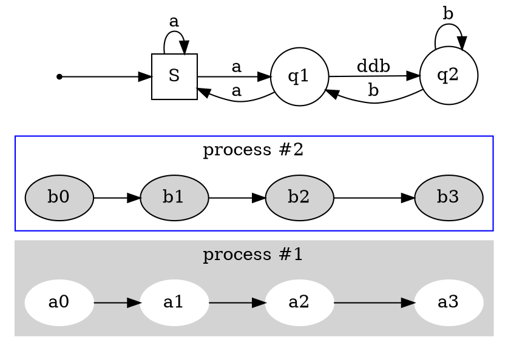

# Graphviz

More at <http://viz-js.com/>.

```graphviz
digraph finite_state_machine {
    rankdir=LR;
    size="8,5"

subgraph cluster_0 {
		style=filled;
		color=lightgrey;
		node [style=filled,color=white];
		a0 -> a1 -> a2 -> a3;
		label = "process #1";
	}

	subgraph cluster_1 {
		node [style=filled];
		b0 -> b1 -> b2 -> b3;
		label = "process #2";
		color=blue
	}


    node [shape = square]; S;
    node [shape = point ]; qi

    node [shape = circle];
    qi -> S;
    S  -> q1 [ label = "a" ];
    S  -> S  [ label = "a" ];
    q1 -> S  [ label = "a" ];
    q1 -> q2 [ label = "ddb" ];
    q2 -> q1 [ label = "b" ];
    q2 -> q2 [ label = "b" ];
}
```